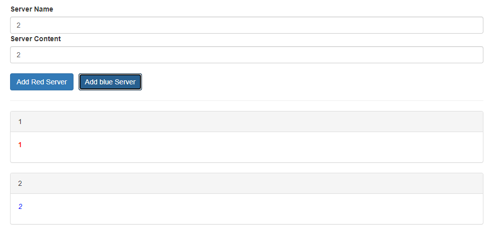

# Server-Angular-project

1. inicializacia aplikacie Angular (scss)
   commit
2. instalacia balicka (verzia @3) a setup bootstrap
   commit
3. vytvorit vramci app.component.html kostru podobnu dizajnu 
4. rozdelit layout na dve komponenty, a to: cockpit a server-element (zacinam od server-element)
   commit
5. vyriesit komunikaciu medzi komponentami
